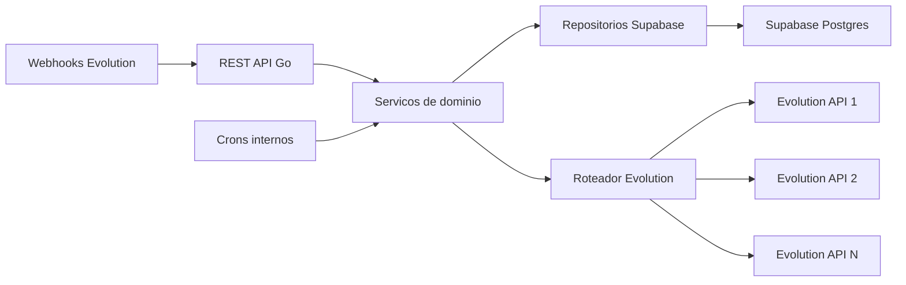

# Visao geral

O backend sera responsavel por controlar um sistema de aquecimento de chips usando Evolution API como gateway WhatsApp e Supabase como banco operacional.

## Objetivos

- Gerenciar varias Evolution APIs, inicialmente 5, mas com quantidade configuravel.
- Criar, conectar, consultar e reiniciar instancias WhatsApp na Evolution.
- Criar instancias com proxy quando configurado.
- Salvar numeros, instancias, mensagens fixas, conversas, execucoes, eventos e logs.
- Agendar conversas entre numeros de forma gradual e variada.
- Executar acoes suportadas pela Evolution API, como texto, presenca digitando, reacao, resposta citada, midia, sticker e atualizacao de status quando habilitado.
- Calcular percentual de aquecimento por numero com regras parametrizadas por `.env`.
- Monitorar conexao das instancias por cron e redistribuir carga quando uma Evolution estiver indisponivel.

## Arquitetura proposta

## Componentes

- `api`: handlers HTTP, autenticacao interna, validacao e serializacao.
- `config`: leitura de `.env`, Evolution APIs, regras de aquecimento e Supabase.
- `evolution`: cliente HTTP da Evolution API v2 com compatibilidade isolada por versao.
- `router`: escolha da Evolution API por saude, capacidade e afinidade da instancia.
- `scheduler`: crons para conexao, fila de execucao, retries e calculo de score.
- `repository`: acesso ao Supabase/Postgres.
- `warming`: regras de negocio de aquecimento, selecao de pares, mensagens e acoes.
- `webhook`: entrada de eventos da Evolution para atualizar status e mensagens.

## Fluxo basico

1. Cadastrar Evolution APIs via `.env`.
2. Cadastrar proxies opcionais.
3. Cadastrar numeros.
4. Criar instancia na Evolution para cada numero.
5. Conectar via QR code ou pairing code.
6. Criar templates de mensagens e conversas.
7. Scheduler monta execucoes entre pares de numeros.
8. Executor chama Evolution API e persiste resultado.
9. Webhooks e crons atualizam estado, falhas e score.

## Principios de implementacao

- Toda acao externa deve gerar registro em `execution_logs`.
- A instancia deve manter afinidade com uma Evolution API, mas pode ser recriada em outra API quando houver falha operacional.
- Regras de aquecimento devem ser configuraveis sem deploy.
- O backend nao deve depender de exatamente 5 Evolution APIs; 5 sera apenas a configuracao inicial.
- A documentacao e o codigo devem tratar endpoints da Evolution como adaptadores externos, nao como modelo interno do dominio.

