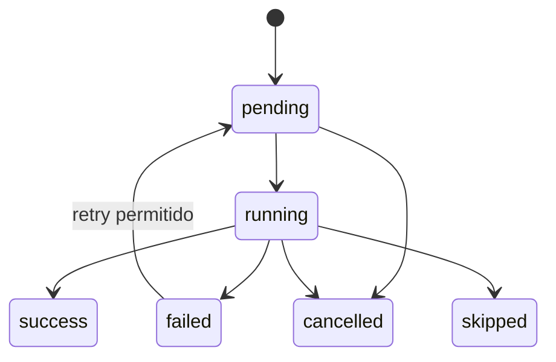

# Crons e orquestracao

Os crons rodam dentro do processo Go na primeira versao, mas a execucao de jobs deve ser intermediada por RabbitMQ. Se o backend escalar horizontalmente, os consumidores usam ack/nack da fila e locks no Postgres para evitar execucao duplicada.

## Crons

### `evolution_health_check`

Intervalo: `EVOLUTION_HEALTH_CHECK_SECONDS`.

Responsabilidades:

- chamar endpoint simples de cada Evolution API;
- atualizar `evolution_servers.health_status`;
- registrar latencia e erro;
- impedir novas execucoes em servidores `down` ou `disabled`.

### `instance_connection_check`

Intervalo: `INSTANCE_HEALTH_CHECK_SECONDS`.

Responsabilidades:

- consultar `GET /instance/connectionState/{instance}`;
- atualizar `instances.status`;
- marcar `phone_numbers.status` como `paused` ou `lost` conforme regras;
- reiniciar instancia quando politica permitir.

### `warming_planner`

Intervalo: configuravel, recomendado 5 a 15 minutos.

Responsabilidades:

- selecionar numeros elegiveis;
- respeitar limites diarios por numero;
- evitar pares repetidos em janela curta;
- escolher script por score, categoria e peso;
- criar `warming_jobs` com `scheduled_at`.

### `warming_executor`

Intervalo: `WARMING_TICK_SECONDS`.

Responsabilidades:

- buscar jobs `pending` vencidos;
- publicar jobs vencidos em `aquecedor.warming.jobs`;
- consumir mensagens da fila com prefetch configuravel;
- travar jobs com `FOR UPDATE SKIP LOCKED`;
- executar passos do script;
- respeitar delay entre passos;
- salvar cada chamada externa em `execution_logs`;
- atualizar score apos sucesso/falha.

### `event_processor`

Intervalo: 5 a 15 segundos, ou worker assíncrono.

Responsabilidades:

- processar `evolution_events` nao processados;
- consumir eventos publicados em `aquecedor.evolution.events`;
- associar mensagens recebidas/enviadas a `execution_logs`;
- atualizar chaves de mensagem para replies/reactions;
- atualizar status de conexao.

### `score_recalculator`

Intervalo: diario, recomendado madrugada.

Responsabilidades:

- recalcular score de aquecimento a partir de eventos e logs;
- zerar contadores diarios;
- mudar status `warming` para `warm` quando atingir score minimo;
- aplicar penalidades por desconexao, falha ou inatividade.

## Selecionador de Evolution API

Ordem recomendada:

1. se instancia ja existe, usar `instances.evolution_server_id`;
2. se nova instancia, filtrar servidores `enabled` e `healthy`;
3. remover servidores acima de `max_concurrent_jobs`;
4. escolher por weighted round-robin ou menor carga ponderada;
5. persistir decisao em `instances`.

## Selecionador de proxy

Ordem recomendada:

1. usar proxy informado manualmente se estiver habilitado;
2. filtrar proxies `enabled`;
3. respeitar `max_instances`;
4. escolher `least_used`;
5. incrementar contador apos criacao bem-sucedida da instancia.

## Maquina de estados do job

## Regras de seguranca operacional

- Nunca executar job para instancia `close`, `failed` ou `paused`.
- Nunca usar o mesmo numero como remetente e destinatario.
- Nunca ultrapassar limite diario por numero.
- Aplicar jitter em todos os delays.
- Registrar payload e resposta de toda chamada externa.
- Pausar numero apos falhas consecutivas.
